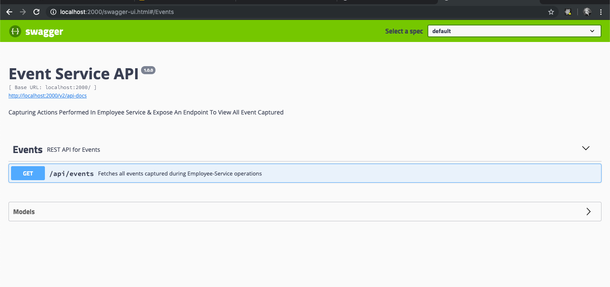
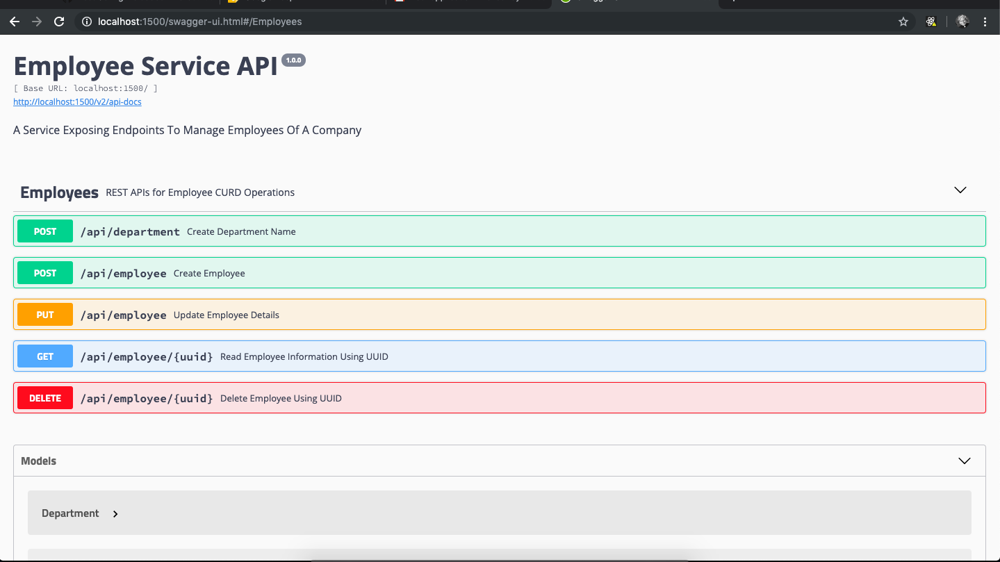

# employee-event-api
An application to Perform CURD operation on employees of a company using Spring Boot, Apache Kafka, Docker, PostgreSQL.

* Ensure Docker installed in your machine.
* Ensure ports mentioned in the docker-compose.yml file not in use, if they are in use change ports in docker-compose.yml file as per your preference.
* Pull this repository and run the following command in root folder **docker-compose run -d**
* Once all services started, goto http://localhost:1500/swagger-ui.html to perform employee related operations and http://localhost:2000/swagger-ui.html to checks events occurred through employee-services.
* Use **takeaway** as username as well as password to add, update, delete employee.
* Read swagger documents carefully for each operation before requesting to server.
* Check screenshots folder for your reference.

    
    

